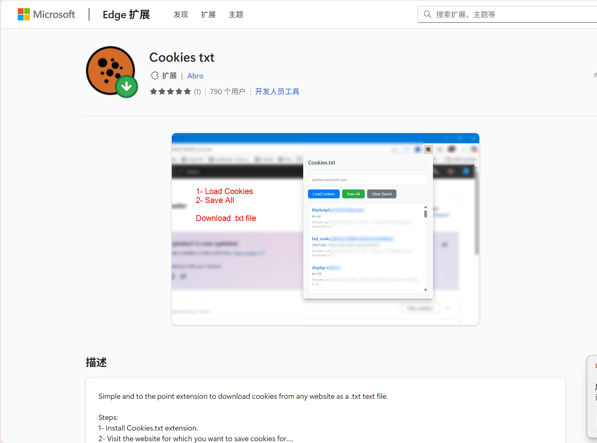
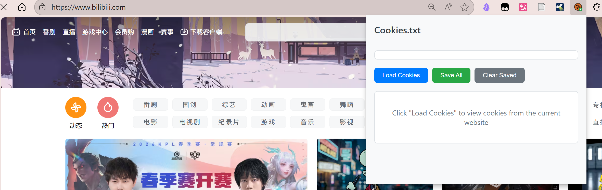

# 🔗 Link Resolver

[](https://github.com/Soulter/AstrBot)
[](LICENSE)

支持监听群内 **B站** / **抖音** / **小红书** 链接，自动解析并下载发送视频或图集内容。无需任何命令，发链接即可触发。

---

## ✨ 特性

- 📺 **B站视频解析**：支持多种画质选择，支持多P视频批量下载
- 🎵 **抖音解析**：支持视频和图文笔记，自动下载并发送
- 📕 **小红书原图解析**：支持视频和图文笔记，可下载原图

---

## ⚙️ 配置项
在 AstrBot 管理面板的插件配置中可调整以下选项：

### 基础设置

| 配置项 | 说明 | 默认值 |
|--------|------|--------|
| `enable_platforms` | 勾选要启用解析的平台 | B站, 抖音, 小红书 |
| `retry_count` | 解析失败重试次数（所有平台共用） | 3 |
| `max_video_size_mb` | 最大视频大小限制 (MB)，超过则跳过下载或自动降画质 | 200 |
| `api_timeout_sec` | 发送消息超时时间 (秒) | 600 |
| `auto_cleanup_delay` | 视频发送后自动删除延迟 (秒) | 60 |
| `reaction_emoji_enabled` | 识别链接后是否发表情回应 | ✅ 开启 |
| `reaction_emoji_id` | 回应的表情 ID (如 128169 👍) | 128169 |

### B站设置

| 配置项 | 说明 | 默认值 |
|--------|------|--------|
| `bili_video_quality` | 默认下载画质 | 1080P高帧率 |
| `bili_allow_quality_fallback` | 超限时自动降画质 | ✅ 开启 |
| `bili_merge_send` | 合并转发发送 (不开启则只发视频) | ❌ 关闭 |
| `bili_enable_multi_page` | 启用多P视频下载 | ✅ 开启 |
| `bili_multi_page_max` | 多P最多下载数量 | 3 |

### 抖音设置

| 配置项 | 说明 | 默认值 |
|--------|------|--------|
| `douyin_max_media` | 图集最多发送媒体数 | 99 |
| `douyin_merge_send` | 视频使用合并转发 | ✅ 开启 |

### 小红书设置

| 配置项 | 说明 | 默认值 |
|--------|------|--------|
| `xhs_max_media` | 图集最多发送媒体数 | 99 |
| `xhs_merge_send` | 视频使用合并转发 | ✅ 开启 |
| `xhs_download_original` | 下载原图 (PNG/JPEG) | ✅ 开启 |
| `xhs_use_cookies` | 使用自定义 Cookies | ❌ 关闭 |
| `xhs_auto_unmerge_threshold_mb` | 图片总大小超过此值时停止合并转发 (MB) | 50 |


---

## 使用方法
直接在群内发送包含以下链接的消息即可自动解析

---

## 📁 目录结构

```
astrbot_plugin_link_resolver/
├── main.py              # 主入口
├── metadata.yaml        # 插件元信息
├── _conf_schema.json    # 配置项定义
├── requirements.txt     # 依赖
├── core/                # 核心解析模块
│   ├── bilibili/        # B站解析
│   ├── douyin/          # 抖音解析
│   ├── xiaohongshu/     # 小红书解析
│   └── common/          # 公共工具
├── cache/               # 媒体缓存目录
└── cookies/             # Cookies 存放目录
```

---

## 🍪 Cookies 配置（可选）

填写 B 站 Cookie 可解锁更高画质（如 1080P60、4K）。

### 方式一：管理面板配置（推荐）

1. 安装浏览器插件 [Cookies txt](https://microsoftedge.microsoft.com/addons/detail/cookies-txt/dilbcaaegopfblcjdjikanigjbcbngbk?)
2. 打开 [bilibili.com](https://www.bilibili.com) 并登录
3. 点击插件的 **Load Cookies**，复制全部内容
4. 在 AstrBot 管理面板 → 插件配置 → **B站Cookies** 粘贴





### 方式二：手动放置文件

将 Cookie 内容保存到 `cookies/bili_cookies.txt`（插件会自动创建目录）


---


## 📄 许可证

本项目采用 [GPL-3.0](LICENSE) 许可证。

---

## 🙏 致谢

- [astrbot_plugin_parser](https://github.com/Zhalslar/astrbot_plugin_parser) 
